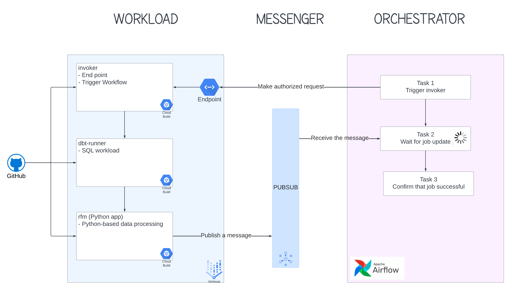

# WHY AM I GIVING BACK?

I felt so lost when I first started my journey in AI/ML. I had great models, but had no way or no idea of how to bring them to the end user, nor how to make them scalable, sustainable, and maintainable.

Hope this is helpful to someone who is in the same position as I was, and when you are in a better position, please help someone else who is in need.

# THE DESIGN



There are 3 main entities in this design: **Workload**, **Messenger**, and **Orchestrator**.

After a while, this is the general design that I found to be the most scalable, maintainable, and sustainable. The most important thing is Workload is separated from Orchestrator. A common mistake I have seen in teams is that to bundle everything into one monolith. For instance, Airflow operators are abused to do everything, from data processing, to model training, etc. This separation allows resources management to be done better for each entity. Workload normally requires heavy workers while orchestrator requires deligent uptime.

Note that the choice of implementation for each entity can vary as long as they serve their roles. In this particular codebase, Vertex AI is chosen to be Workload, GCP PubSub to be Messenger, and GCP Composer (Airflow) to be Orchestrator.

The coordination among these three entities are simple:

```
Orchestrator tells Workload what to do via Messenger
```

### Workload

In general, there are 3 main components that I think can be the minimum to start an MLOps Workload:
1. Invoker: this is basically the API endpoint - the contact point of Workload.
2. SQL Runner: involving SQL in Feature Engineering is almost unavoidable, so this component is designated specifically for running SQL processing.
3. Python-based application: model training, batch serving, etc. You name it.

All of these components can be homed within a repo technically, however, I found it best to be in separate Docker images to keep the repo clean and compartmentalized. In Vertex AI framework, each Docker image is loaded to be the base image on which a Python application is run. Except for `invoker`, which is a `gunicorn` web application hosted by Vertex AI. This endpoint is exposed to a Vertex AI Service:  think of it as an API.

### Messenger

This entity is quite straightforward: get a message from the sender, then deliver it to the receiver.

### Orchestrator

The flow is quite simple:
1. Make the request (might be cron scheduled).
2. Wait for the job to be done.
3. Check and confirm that the job has been done properly.

All the following alerting or healthcheck should be done here as well.

# INTRODUCTION

This is Recency Frequency Montetary (RFM) model. If you do not know what RFM is, please read [here](https://en.wikipedia.org/wiki/RFM_(market_research)).


# Set up and run dbt for local development

- Go to `rfm/`.
- Copy `.env` files to local, change `DBT_USER` to preferred name, keep everything else the same for now.
- Run `./local-ci.sh`, this will build the Docker image to the local Docker container and run it. When it finishes, we should see we are inside the running Docker at `/dbt`. **NOTE**: this is **inside** the Docker image.
- Run `cd /local/dbt` to move to mounted volumne that points to `/rfm` in your local laptop.
- Run `export RUN_DATE=2022-09-29`, or any date for testing.
- Run `make run` to run dbt.
- All changes in dbt `.sql` files should reflect **directly** on the running Docker, so after making changes, just run `make run` again.

# dbt lineage graph
1. Run `./local-ci.sh`
2. Run `cd /local/dbt`
3. Run `make run-docs`
4. Wait about 10 seconds for the serve to be up
5. Go to `localhost:8080`, click on the graph icon on the bottom right corner, then feast your eyes on the graph

# SQL formatter (Optional)
Run `./sqlformat path_to_sql_file`, for instance, `./sqlformat.sh ./dbt/models/biz_rfm`. This will automatically format all `.sql` files to standard format.


# Trouble shooting

For error such that `No 'src' module found`, run `pip install -e .`, it will run the `setup.py` to install all modules.

For testing Cloud Run endpoint, use these requests:

```
curl -X GET "https://rfm-vertex-ai-invoker-rvpkcg5tnq-uc.a.run.app/invoke?run_date=2022-09-25" \
  -H "Content-Type:application/json" \
  -H "Authorization: Bearer $(gcloud auth print-identity-token)"


curl -X GET "https://rfm-vertex-ai-invoker-rvpkcg5tnq-uc.a.run.app/healthcheck" \
  -H "Content-Type:application/json" \
  -H "Authorization: Bearer $(gcloud auth print-identity-token)"

curl -X GET http://127.0.0.1:8080/healthcheck
```